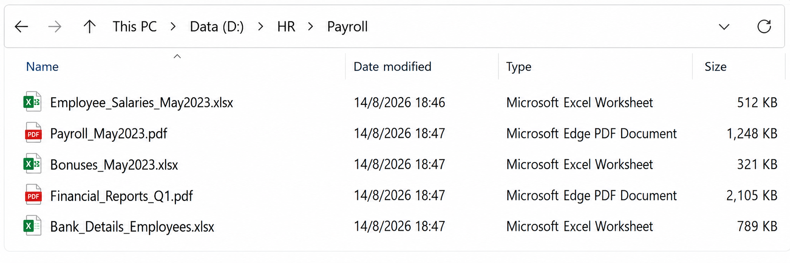

# DFIR Incident Response Investigation

## Unauthorized Access, Privilege Escalation & Suspected Data Exfiltration

---

## Overview

This project documents a simulated Digital Forensics and Incident Response (DFIR) investigation involving suspected unauthorized access to an HR workstation.

The investigation reconstructs the incident from initial remote access through PowerShell execution, account creation, privilege escalation, sensitive file access, and outbound network communication.

The objective was to identify Indicators of Compromise (IOCs), reconstruct the attack timeline, assess the potential impact, and recommend appropriate incident response actions.

---

## Incident Scenario

An HR workstation identified as `HR-PC12` was accessed outside normal working hours.

The investigation identified suspicious activity including remote authentication, PowerShell execution, creation of a new user account, privilege escalation, access to sensitive employee and financial information, and communication with an external IP address.

The activity was investigated as a potential workstation compromise and possible data exfiltration event.

---

## Attack Timeline

| Stage | Activity |
|---|---|
| 1 | Remote authentication detected |
| 2 | Successful authentication established |
| 3 | PowerShell execution observed |
| 4 | `backupsvc` account created |
| 5 | `backupsvc` added to Administrators |
| 6 | Sensitive HR and financial files accessed |
| 7 | Connection established with external IP |
| 8 | Approximately 118 MB transferred externally |

### Reconstructed Attack Chain

**Initial Access → PowerShell Execution → Account Creation → Privilege Escalation → Sensitive File Access → External Connection → Suspected Exfiltration**

---

## Investigation Findings

### 1. Unauthorized Access

The affected workstation was accessed remotely outside normal working hours.

Multiple authentication events were reviewed to determine whether the activity was consistent with legitimate employee behavior or unauthorized access.

The surrounding events indicated that the access was suspicious.

---

### 2. PowerShell Execution

PowerShell execution was identified after the successful authentication event.

PowerShell itself is a legitimate Windows administration tool, but its presence alongside account creation, privilege escalation, and sensitive file access increased the likelihood of malicious activity.

*PowerShell activity identified during the simulated investigation.*

---

### 3. Unauthorized Account Creation

A new account named:

`backupsvc`

was created during the suspicious activity.

The account was subsequently associated with administrative privileges.

The timing of the account creation made it a significant Indicator of Compromise.

---

### 4. Privilege Escalation

The `backupsvc` account was added to the local Administrators group.

This provided elevated privileges and potentially allowed the account to access protected system resources and sensitive information.

The privilege change was therefore treated as a significant escalation event.

---

### 5. Sensitive File Access

The compromised workstation contained sensitive HR and financial information.

The investigation identified access to information including:

- Employee records
- Salary information
- Payroll data
- Financial reports

*Evidence of sensitive file access during the investigation.*

---

### 6. External Network Communication

The investigation identified communication with the external IP address:

`45.77.155.208`

The connection occurred after the suspicious account activity and sensitive file access had been observed.

The sequence was therefore considered potentially related to the compromise.

---

### 7. Suspected Data Exfiltration

Approximately **118 MB of data** was transferred from the affected environment to the external destination.

Because sensitive HR and financial information had been accessed before the outbound transfer, the event was assessed as **suspected data exfiltration**.

*Network evidence associated with the outbound data transfer.*

---

## Indicators of Compromise

| Indicator | Value |
|---|---|
| Affected Host | `HR-PC12` |
| Source IP | `185.203.116.91` |
| Destination IP | `45.77.155.208` |
| Suspicious Account | `backupsvc` |
| Execution Method | PowerShell |
| Privilege Change | Added to Administrators |
| Targeted Information | HR, payroll and financial data |
| Outbound Transfer | Approximately 118 MB |
| Incident Classification | Suspected Data Exfiltration |

---

## MITRE ATT&CK Mapping

The observed activity was mapped to relevant MITRE ATT&CK techniques.

| Activity | Technique |
|---|---|
| PowerShell execution | T1059.001 — PowerShell |
| Account creation | T1136 — Create Account |
| Privilege modification | T1098 — Account Manipulation |
| Sensitive file access | T1005 — Data from Local System |
| Data transfer | T1041 — Exfiltration Over C2 Channel |

The mapping provides a standardized representation of the observed attack behavior.

---

## Incident Response Actions

The following actions were recommended.

### Containment

1. Isolate `HR-PC12` from the network.
2. Block the identified external IP address.
3. Disable the `backupsvc` account.
4. Remove unauthorized administrative privileges.

### Investigation

1. Review PowerShell execution logs.
2. Review Windows authentication and security logs.
3. Review firewall and network connection logs.
4. Investigate the external destination IP.
5. Identify files accessed during the incident.
6. Determine whether sensitive information was included in the outbound transfer.

### Recovery

1. Reset potentially compromised credentials.
2. Remove unauthorized accounts and persistence mechanisms.
3. Restore the workstation to a trusted state if compromise is confirmed.
4. Continue monitoring for related activity.

---

## Incident Assessment

The evidence forms a consistent sequence of suspicious activity:

**Remote Access → PowerShell → Account Creation → Privilege Escalation → Sensitive File Access → External Communication → Data Transfer**

The combination of these events indicates a likely compromise within the simulated environment.

The outbound transfer of approximately 118 MB following access to sensitive HR and financial information was therefore classified as **suspected data exfiltration**.

Further forensic analysis would be required to confirm exactly which files were transferred and whether the external destination was controlled by the attacker.

---

## Key Lessons from the Investigation

The investigation demonstrated the importance of correlating individual security events rather than investigating them in isolation.

A single PowerShell execution may be legitimate. A single after-hours login may also be legitimate.

However, when these events occur alongside:

- Unauthorized account creation
- Privilege escalation
- Sensitive file access
- External network communication
- Large outbound data transfers

the combined activity becomes significantly more suspicious.

---

## Skills Demonstrated

- Digital Forensics and Incident Response
- SOC investigation
- Windows security event analysis
- Incident timeline reconstruction
- IOC identification
- PowerShell investigation
- Account and privilege analysis
- File access investigation
- Network activity analysis
- Data exfiltration detection
- MITRE ATT&CK mapping
- Incident containment
- Security incident reporting

---

## Conclusion

This simulated investigation demonstrated a complete DFIR workflow from initial access through suspected data exfiltration.

By correlating authentication activity, PowerShell execution, account creation, privilege escalation, sensitive file access, and network activity, the investigation reconstructed the likely attack sequence and identified the key indicators associated with the compromise.

The project demonstrates a practical approach to SOC investigation and incident response, with emphasis on evidence correlation, timeline reconstruction, threat identification, containment, and professional reporting.

---

